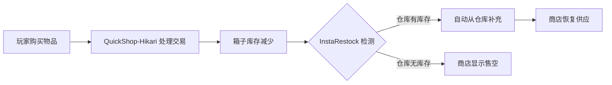

description: InstaRestock商店自动补货系统

# InstaRestock 自动补货

InstaRestock 是一秋小镇服务器上的**商店自动补货插件**。它的核心功能是在玩家商店（QuickShop-Hikari）售出物品后，自动从指定的「补货仓库」中补充库存，确保商店始终保持充足供应。

[!NOTE]
InstaRestock 解决了玩家商店最头疼的问题——**需要频繁手动补货**。配置自动补货后，玩家只需定期补充仓库库存，商店会自动从仓库中取货上架。

---

## 为什么需要自动补货？

在一秋小镇这样活跃的原版生存服务器中，热门玩家商店的销量可能非常高。手动补货存在以下痛点：

| 痛点 | 说明 |
|------|------|
| **频繁操作** | 热门商店可能每小时都需要补货 |
| **离线缺货** | 玩家离线后商店售空，错失交易机会 |
| **库存不均** | 手动补货容易遗漏某些商品 |
| **时间浪费** | 花大量时间在重复的补货操作上 |

InstaRestock 通过自动化补货流程，让商店主从繁琐的手动操作中解放出来，将更多时间投入到生存、建筑和红石创作中。

[!TIP]
InstaRestock 不会凭空生成物品。它需要你提前在**补货仓库**中存入足够的物品作为库存来源。可以把它理解为「商店从你的私人仓库中自动取货上架」。

---

## 工作原理

InstaRestock 的工作流程如下：

简单来说：

1. 玩家从商店购买物品，箱子中的对应物品减少。
2. InstaRestock 检测到库存变化，检查关联的补货仓库。
3. 如果仓库中有对应物品，自动将物品从仓库移入商店箱子。
4. 商店自动恢复供应状态，下一个玩家可以继续购买。

---

## 配置自动补货

### 步骤一：创建补货仓库

补货仓库本质上就是一个普通的**箱子**，用于存放待补货的物品。

1. 在商店附近（或任何你方便管理的地方）放置一个或多个箱子。
2. 将需要补货的物品放入箱子中。
3. 记住箱子的位置。

[!TIP]
补货仓库建议放在商店的**正下方或背后**，方便集中管理。如果商品种类多，建议使用双箱子甚至多组箱子。

### 步骤二：关联仓库与商店

将补货仓库与你的 QuickShop 商店关联起来：

| 命令 | 说明 |
|------|------|
| `/instarestock link` | 进入链接模式，依次点击补货仓库和商店箱子完成关联 |
| `/instarestock unlink` | 进入取消链接模式，点击商店箱子解除关联 |
| `/instarestock info` | 查看当前商店的补货配置信息 |
| `/instarestock status` | 查看所有已关联商店的补货状态 |

**操作流程**：

1. 执行 `/instarestock link`
2. 点击你的**补货仓库箱子**（来源）
3. 点击你的**商店箱子**（目标）
4. 关联成功，提示确认信息

[!WARNING]
每个商店只能关联一个补货仓库。如果需要为多个商店补货，请创建多个补货仓库分别关联。一个补货仓库可以同时关联多个商店（共享库存源）。

### 步骤三：验证补货是否生效

1. 从你的商店购买一个物品。
2. 观察补货仓库中的对应物品是否减少了一个。
3. 观察商店箱子中的物品是否自动恢复。

如果以上步骤均正常，说明自动补货已成功配置。

---

## 与商店插件的集成

InstaRestock 专门为 QuickShop-Hikari 设计，集成关系如下：

| 集成插件 | 集成方式 | 说明 |
|----------|----------|------|
| **QuickShop-Hikari** | 监听商店交易事件 | 当物品被购买时自动触发补货 |
| **XConomy** | 不直接集成 | 交易金额仍由 QuickShop 处理，InstaRestock 只负责物品流转 |
| **UltimateShop** | 不适用 | 全局商店为无限库存，无需补货 |
| **ExoShopkeepers** | 不适用 | NPC 商店由管理员维护，使用不同的补货机制 |

[!NOTE]
InstaRestock **仅处理物品的物理转移**，不涉及任何金币操作。经济交易由 QuickShop-Hikari 和 XConomy 完全负责。

---

## 对服务器经济的影响

InstaRestock 对一秋小镇的经济生态有积极影响：

| 影响维度 | 说明 |
|----------|------|
| **提高供应稳定性** | 商店不再频繁缺货，买家体验提升 |
| **促进交易活跃度** | 稳定的供应吸引更多玩家前来购买 |
| **降低经营成本** | 商店主节省时间，可以更专注于生产 |
| **价格趋于稳定** | 充足供应减少因缺货导致的价格暴涨 |
| **抑制垄断行为** | 自动化补货让更多人能持续经营，减少囤积居奇 |

[!TIP]
对于红石材料等高频消耗品商店，InstaRestock 尤为重要。一秋小镇作为红石服务器，红石粉、中继器、活塞等材料的消耗量极大，自动补货能显著提升商店运营效率。

---

## 常见问题

**Q: 自动补货会凭空生成物品吗？**
A: 不会。InstaRestock 严格从你预先准备好的补货仓库中转移物品。仓库空了就不会再补货，你仍需定期收集资源补充到仓库中。

**Q: 补货仓库被破坏了怎么办？**
A: 如果补货仓库被破坏，InstaRestock 会失去关联。你需要重新创建仓库并使用 `/instarestock link` 重新关联。

**Q: 自动补货有延迟吗？**
A: 基本无感知延迟。物品在交易完成的瞬间就会自动补充，下一个玩家看到的商店始终是满货状态。

**Q: 我能让一个仓库同时给多个商店补货吗？**
A: 可以。一个补货仓库可以关联多个商店，它们共享仓库中的库存。请注意库存要充足，避免多个商店同时消耗导致仓库提前耗尽。

**Q: 自动补货支持收购商店吗？**
A: InstaRestock 主要为**出售商店**设计。对于收购商店（Buying），被收购的物品会直接存入商店箱子，不需要自动补货。

## 官方文档

> 更多详细信息请参阅 [Modrinth 项目页](https://modrinth.com/project/5kZMR4tZ)。