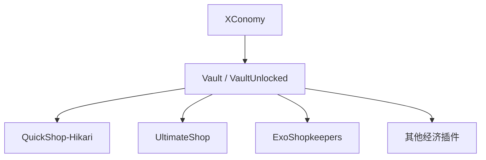

description: XConomy统一经济货币系统

# XConomy 经济系统

XConomy 是一秋小镇服务器的核心经济管理插件，负责统一管理所有玩家的虚拟货币（金币）。服务器内所有涉及金钱的交易——包括玩家商店购买、出售物品、玩家间转账等——均通过 XConomy 完成。

[!NOTE]
XConomy 是整个经济体系的基石。QuickShop-Hikari、UltimateShop、ExoShopkeepers 等商店插件均通过 Vault 接口与 XConomy 对接，确保经济数据的统一性和一致性。

---

## 核心功能

- **统一货币管理**：所有玩家拥有独立账户，存储金币余额。
- **Vault 兼容**：通过 Vault / VaultUnlocked 接口为其他插件提供标准经济 API。
- **离线交易支持**：玩家离线时仍可接收来自 `/pay` 的转账。
- **经济数据持久化**：数据存储于 MySQL 数据库，确保数据安全。
- **多世界经济**：支持在不同世界（主世界、地狱、末地）间共享或隔离经济数据。

---

## 常用命令

以下是玩家日常使用最频繁的命令：

| 命令 | 别名 | 说明 | 权限 | 示例 |
|------|------|------|------|------|
| `/balance` | `/bal`, `/money` | 查看当前余额 | 无需权限 | `/balance` |
| `/pay <玩家> <金额>` | — | 向指定玩家转账 | 无需权限 | `/pay Steve 100` |
| `/baltop` | — | 查看服务器财富排行榜 | 无需权限 | `/baltop` |
| `/paytoggle` | — | 开关是否允许他人向你转账 | 无需权限 | `/paytoggle` |
| `/xconomy:help` | — | 查看 XConomy 帮助信息 | 无需权限 | `/xconomy:help` |

[!TIP]
使用 `/baltop` 可以查看服务器前 10 名 richest 玩家排行榜。排行榜会实时更新，激励大家努力赚取金币！

### 管理员命令

| 命令 | 说明 | 权限 |
|------|------|------|
| `/xconomy:give <玩家> <金额>` | 给予玩家指定金额 | `xconomy.admin.give`
| `/xconomy:take <玩家> <金额>` | 扣除玩家指定金额 | `xconomy.admin.take`
| `/xconomy:set <玩家> <金额>` | 设置玩家余额为指定值 | `xconomy.admin.set`
| `/xconomy:purge <玩家>` | 重置玩家经济数据 | `xconomy.admin.purge` |

[!WARNING]
管理员命令仅限服主及管理团队使用。滥用经济权限将导致严重后果，包括封禁处理。如发现经济异常请及时联系管理员。

---

## 与 Vault / VaultUnlocked 的集成

XConomy 通过实现 Vault 的 Economy 接口，为服务器内所有需要经济功能的插件提供统一 API。在一秋小镇中，具体集成关系如下：



这意味着：

1. **QuickShop-Hikari** 玩家商店的买卖金额直接操作 XConomy 账户。
2. **UltimateShop** 全局商店的购买/出售价格由 XConomy 扣除/增加。
3. **ExoShopkeepers** NPC 商店的交易同样通过 Vault 接口完成扣款和付款。
4. 任何新增的、兼容 Vault 的经济插件都可无缝接入现有体系。

---

## 获取金币的途径

在一秋小镇的原版生存红石服务器中，获取金币的主要方式包括：

| 途径 | 说明 |
|------|------|
| 出售物品给玩家商店 | 通过 QuickShop-Hikari 将物品卖给其他玩家 |
| 出售物品给全局商店 | 通过 UltimateShop 将物品出售给系统 |
| NPC 商店交易 | 通过 ExoShopkeepers 与 NPC 进行交易 |
| 玩家间交易 | 与其他玩家协商后使用 `/pay` 转账 |
| 红石装置售卖 | 制作并出售红石机械、自动化设备 |
| 服务提供 | 为其他玩家提供建筑、红石调试等有偿服务 |

[!NOTE]
一秋小镇禁止任何形式的刷金币行为，包括但不限于利用插件漏洞、多人反复交易套利等。一经发现将没收非法所得并视情节严重程度给予处罚。

---

## API 对接说明（开发者参考）

如果你是一名插件开发者，想让自己的插件接入 XConomy 经济系统，推荐使用 Vault API：

```java
// 获取 Vault 经济接口
Economy economy = Bukkit.getServicesManager().getRegistration(Economy.class).getProvider();

// 查询余额
double balance = economy.getBalance(player);

// 扣款
economy.withdrawPlayer(player, amount);

// 存款
economy.depositPlayer(player, amount);
```

XConomy 同时也提供自身的 API（`XConomyAPI`），支持更高级的功能如非玩家账户、跨服经济同步等。

---

## 常见问题

**Q: 我的余额不对，怎么办？**
A: 请使用 `/balance` 确认余额。如果确实存在异常，请联系在线管理员核实交易记录。

**Q: 转账时提示余额不足，但我明明有钱？**
A: 请检查是否使用了正确的命令格式 `/pay <玩家名> <金额>`。金额不需要输入货币单位，直接输入纯数字即可。

**Q: 我能给离线玩家转账吗？**
A: 可以。XConomy 支持离线转账，对方下次上线时会收到转账通知。
